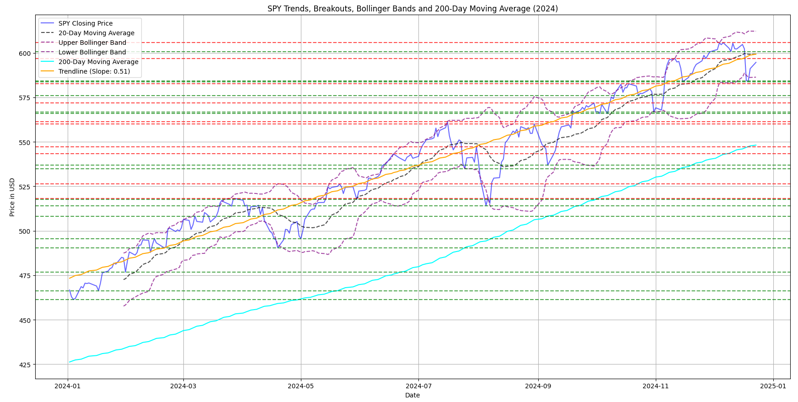
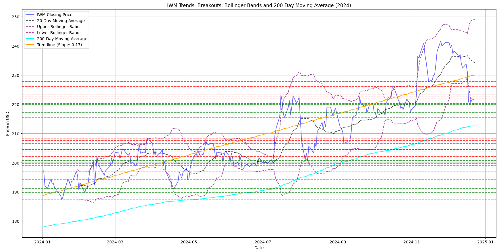

# Financial Data Analysis and Options Backtesting 
# ONLY FOR EDUCATIONAL PURPOSES


This repository contains a Python script for analyzing financial market data, detecting trends, and providing trading recommendations based on support levels, Bollinger Bands, and implied volatility (IV). The script also includes an interactive graphical user interface (GUI) for enhanced usability.

## Features

- **Trend Detection**: Identifies upward and downward trends using local maxima and minima.
- **Bollinger Bands**: Calculates upper and lower Bollinger Bands for closing prices.
- **Trendline Calculation**: Uses linear regression to compute trendlines.
- **Implied Volatility (IV)**: Fetches IV data from Yahoo Finance options chains.
- **Backtesting**: Simulates a put-option trading strategy to analyze profitability.
- **Interactive GUI**: Allows users to select ETFs and specific years for analysis.
- **Visualization**: Plots trends, Bollinger Bands, support/resistance levels, and moving averages.

## Prerequisites

- Python 3.8 or later
- Required libraries:
  - `numpy`
  - `pandas`
  - `matplotlib`
  - `yfinance`
  - `scipy`
  - `sklearn`
  - `yahoo_fin`
  - `tkinter`

You can install the required packages using pip:

```bash
pip install numpy pandas matplotlib yfinance scipy scikit-learn yahoo-fin
```

## How to Use

1. Clone the repository:
   ```bash
   git clone https://github.com/yourusername/financial-data-analysis.git
   cd financial-data-analysis
   ```

2. Run the script:
   ```bash
   python main.py
   ```

3. Select an ETF and a year in the interactive GUI to analyze trends and get trading recommendations.

## Example Output

- **Visualization**: The script plots trends, Bollinger Bands, 200-day moving averages, and support/resistance levels.
- **Recommendation**: Displays a put-option recommendation based on support levels and IV in a separate window.
- **Backtesting Results**: Prints the total and average profits from the simulated trading strategy.

## Screenshots

SPY ETF Picture:


IWM ETF Picture:



## Contributing

Feel free to fork this repository and submit pull requests for improvements or new features. For major changes, please open an issue first to discuss your ideas.

### Collaboration and Suggestions

Contributions, feedback, and suggestions are always welcome! Whether it's a bug fix, a feature request, or an idea to improve the project, feel free to reach out or create an issue in the repository.

## License

This project is licensed under the MIT License - see the [LICENSE](LICENSE) file for details.

## Acknowledgements

- [Yahoo Finance API](https://pypi.org/project/yfinance/)
- [Yahoo Fin](https://theautomatic.net/yahoo_fin-documentation/) for options data
- Inspired by common financial analysis and trading strategies.
